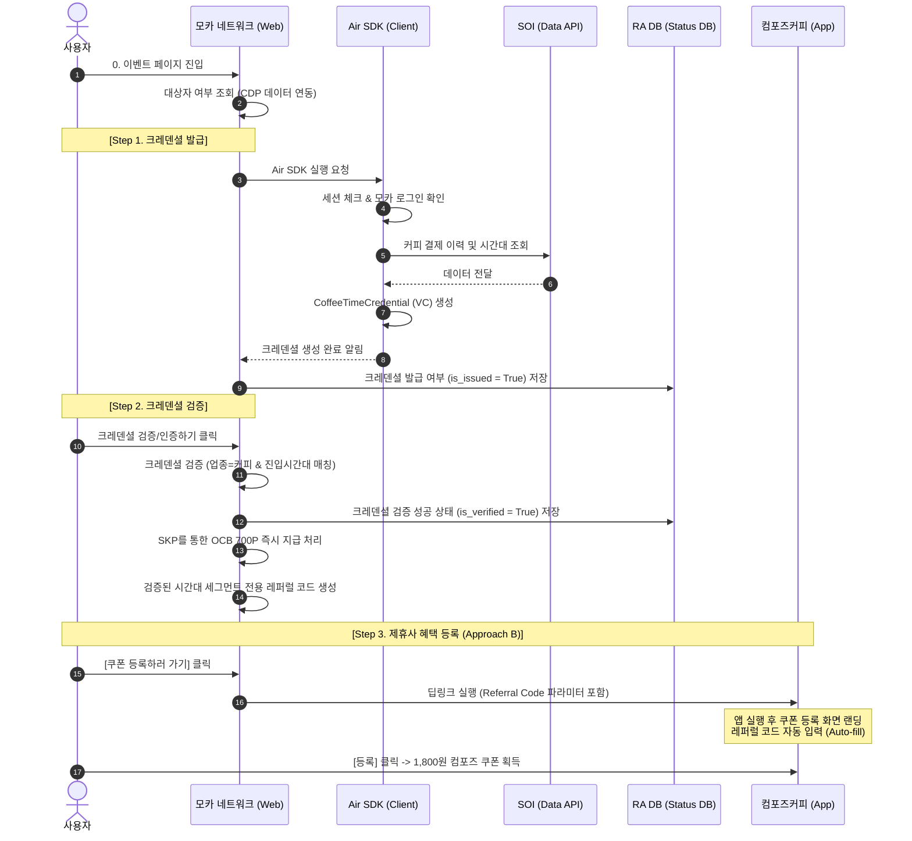

# [기획서] 블록체인 크레덴셜 기반 커피 소비 데이터 마케팅 및 제휴 연계 (컴포즈커피)

본 문서는 OK캐쉬백(OCB) 오프라인 결제 데이터를 블록체인 크레덴셜(Verifiable Credential) 기술과 결합하여, 유저 타겟팅 및 제휴사(컴포즈커피) 마케팅 전환을 유도하는 비즈니스 모델(BM)에 대한 상세 기획서입니다.

---

## 1. 프로젝트 개요

### 1.1 배경 및 목적
* **데이터 가치 입증**: OCB가 축적한 방대한 오프라인 결제 데이터(커피 브랜드 방문 시간대 등)를 활용하여 정교한 타겟 마케팅을 집행합니다.
* **Web3 기술 상용화**: 사용자 개인정보를 서버에 중앙 집중형으로 노출하지 않고, 블록체인 기반의 **자기주권신원(DID) 및 크레덴셜(VC)** 기술을 활용해 데이터를 증명하고 안전하게 검증합니다.
* **제휴 마케팅 실증**: 타겟팅된 크레덴셜 유저를 실제 제휴 브랜드(컴포즈커피)로 전환(Conversion)시키고, 시간대별 고객 행동 패턴에 따른 마케팅 기여도를 체계적으로 트래킹합니다.

### 1.2 주요 성과 지표 (KPI)
1. **크레덴셜 발급률**: OCB 커피 소비 타겟 유저 중 실제 크레덴셜을 발급받은 유저 비율
2. **제휴사 전환율 (CVR)**: 크레덴셜 검증을 마친 유저 중 컴포즈커피 앱으로 이동하여 쿠폰을 등록한 비율
3. **시간대별 전환 패턴 분석**: 아침, 점심, 오후, 저녁 시간대별 유저 세그먼트 중 어떤 군이 가장 높은 쿠폰 사용률과 앱 참여율을 보이는지 측정

---

## 2. 핵심 비즈니스 스킴 (Scheme)

---

## 3. 상세 정책 및 세부 스펙

### 3.1 참여 대상 및 크레덴셜 스키마
* **대상자 기준**: OCB 내 오프라인 매장 방문 데이터 중 **최근 3개월 이내 커피 제휴 사업종 방문 이력**과 **방문 진입 시간대** 정보가 존재하는 유저.
* **크레덴셜 정의**: `CoffeeTimeCredential`

| 구분 | 스펙 상세 | 비고 |
| :--- | :--- | :--- |
| **Title** | `CoffeeTimeCredential` | 크레덴셜 명칭 |
| **Schema Type** | `CoffeeTime` | 데이터 스키마 타입 정의 |
| **Description** | Schema to define CoffeePurchaseTime | 커피 구매 시간 패턴 증명 스키마 |
| **Attributes** | `CoffeePurchaseTime` (string) | 주 구매 시간 패턴 (Segment Grade) |

#### `CoffeePurchaseTime` 세그먼트 분기 정책
유저의 OCB 커피 결제 빈도가 가장 높은 최적 시간대를 식별하여 아래 4가지 중 하나의 세그먼트로 크레덴셜을 발급합니다.
1. **아침 (Morning)**: `06:00 ~ 10:00` 결제 비중이 가장 높은 유저
2. **점심 (Lunch)**: `10:00 ~ 14:00` 결제 비중이 가장 높은 유저
3. **오후 (Afternoon)**: `14:00 ~ 17:00` 결제 비중이 가장 높은 유저
4. **저녁 (Evening)**: `17:00 ~ 22:00` 결제 비중이 가장 높은 유저

---

### 3.2 단계별 프로세스 상세

#### **Step 0. 이벤트 진입**
1. 사용자가 모카 네트워크의 "커피 크레덴셜 이벤트 페이지"에 진입합니다.
2. CDP(Customer Data Platform) 데이터를 사전에 매핑하여 유저가 대상자 조건(OCB 내 커피 방문 데이터 보유 여부)을 만족하는지 검사합니다.
   * **[예외 처리]** 조건 미충족 시, 이벤트 참여 불가 안내 팝업 노출 후 서비스 메인 화면으로 자동 이동시킵니다.
     * *안내 문구*: `"이벤트 참여 대상이 아닙니다. 본 이벤트는 OK캐쉬백으로 커피를 구매하신 내역이 있는 고객을 대상으로 진행됩니다."`

#### **Step 1. 크레덴셜 발급 (Air SDK 연동)**
1. 유저가 `[내 커피 구매 시간대 크레덴셜 만들기]` 버튼을 탭하면 **Air SDK** 바텀시트가 열립니다.
2. SDK는 최소 실행 버전을 충족하는지 체크하고, 미충족 시 마켓 업데이트 팝업을 띄웁니다.
3. Air SDK의 세션 유지 여부를 체크하여 로그인이 풀린 경우 모카 로그인을 진행합니다.
4. SDK는 내부 인프라(SOI)를 통해 유저의 OCB 결제 데이터를 조회하고 `CoffeeTimeCredential`을 생성/발급합니다.
5. 발급이 완료되면 Air SDK 바텀시트가 닫히며 모카 네트워크 웹뷰로 제어권이 반환됩니다.
6. **[RA DB 업데이트]**: 발급 상태 데이터베이스(RA DB)에 해당 유저 식별자와 함께 **발급 완료 여부(`is_issued = True`, `issued_at = Timestamp`)** 정보만 기록합니다. (개인정보 보호를 위해 크레덴셜 원본 데이터는 DB에 저장하지 않음)

#### **Step 2. 크레덴셜 검증**
1. 모카 네트워크 화면에서 `[크레덴셜 인증하고 혜택 받기]` 버튼이 활성화됩니다.
2. 사용자가 검증 버튼을 탭하면, 모카 네트워크 검증 모듈이 유저의 크레덴셜 속성(`CoffeePurchaseTime`)을 판독하여 유효성을 검사합니다.
3. 검증 성공 시:
   * **[RA DB 업데이트]**: 검증 완료 여부(`is_verified = True`, `verified_at = Timestamp`)를 기록합니다.
   * **[보상 1 지급]**: SKP API를 통해 **OCB 포인트 700p**를 유저 지갑에 즉시 적립 요청합니다.
   * **[레퍼럴 코드 발급]**: 유저의 세그먼트 속성에 부합하는 시간대별 고유 레퍼럴 코드를 화면단에 동적으로 로드합니다.
     * 아침형 코드 예시: `COMP_MORNING_[RANDOM_STRING]`
     * 점심형 코드 예시: `COMP_LUNCH_[RANDOM_STRING]`
     * 오후형 코드 예시: `COMP_AFTERNOON_[RANDOM_STRING]`
     * 저녁형 코드 예시: `COMP_EVENING_[RANDOM_STRING]`

#### **Step 3. 제휴사 혜택 연동 (컴포즈커피 앱)**
사용자 경험(UX) 극대화를 위해 **Approach B (딥링크 파라미터 자동 입력 방식)**를 적용합니다.

1. 사용자가 `[컴포즈 커피 쿠폰 받으러 가기]` 버튼을 누릅니다.
2. 시스템은 아래의 딥링크 URL 스키마를 사용하여 컴포즈커피 앱을 호출합니다.
   * **딥링크 스펙**: `composeapp://coupon/register?code=[레퍼럴코드]&segment=[시간대]`
3. **[앱 설치 상태 분기]**
   * **컴포즈 앱이 설치된 경우**: 
     1. 컴포즈 App 내 '쿠폰 등록 페이지'로 다이렉트 랜딩합니다.
     2. 앱 클라이언트는 URL 파라미터 내 `code` 값을 파싱하여 쿠폰 코드 입력 필드에 **자동 입력(Auto-fill)** 처리합니다.
     3. 유저는 직접 타이핑할 필요 없이 **[등록]** 버튼만 탭하면 1,800원 컴포즈 커피 쿠폰 발급이 완료됩니다.
   * **컴포즈 앱이 설치되지 않은 경우**:
     1. OS 플랫폼에 맞춰 App Store 또는 Play Store 다운로드 페이지로 이동합니다.
     2. **[권장 사항]** Deferred Deeplink(지연된 딥링크)를 연동하여 앱 설치 후 최초 실행 시에도 쿠폰 등록 화면으로 이동 및 파라미터 자동 입력이 유지되도록 설계합니다. (미도입 시 클립보드 자동 복사 기능을 차선책으로 적용)

---

## 4. UI/UX 화면 구성 정책

사용자의 이벤트 몰입도를 확보하고 이탈을 줄이기 위해, 직관적인 **3단계 스텝형 카드 레이아웃**을 제공합니다.

### 4.1 진입 단계별 버튼 제어 매트릭스

| 참여 단계 | Step 1 카드 (발급) | Step 2 카드 (검증) | Step 3 카드 (혜택 등록) | 비고 |
| :--- | :--- | :--- | :--- | :--- |
| **최초 진입 상태** | **[발급 버튼 활성화]** | [검증] 비활성화 (Dimmed) | [등록] 비활성화 (Dimmed) | 진행 가능한 Step 1만 버튼 활성화 |
| **Step 1 완료 상태** | [발급 완료] Dimmed 처리 | **[검증 버튼 활성화]** | [등록] 비활성화 (Dimmed) | Step 1 라벨 '완료' 처리 및 Step 2 오픈 |
| **Step 2 완료 상태** | [발급 완료] Dimmed 처리 | [검증 완료] Dimmed 처리 | **[등록하러 가기 활성화]** | Step 2에 유도용 '700P 지급 완료' 뱃지 표시 |

### 4.2 화면 세부 UI 안내 문구

#### **이벤트 메인 및 배너 영역**
* **타이틀**: `커피로 나의 유형 알아보고 700P + 컴포즈 커피 할인 쿠폰 받기!`
* **서브 타이틀**: `내가 주로 커피를 구매하는 시간대를 확인하고 블록체인 크레덴셜을 발급받아 보세요. 인증 완료 시 OK캐쉬백 700P 적립과 함께 컴포즈 커피 쿠폰(1,800원 상당) 혜택을 드립니다.`
* **이벤트 기간**: `2026. 09. 01 ~ 2026. 09. 30`

#### **Step 1. 크레덴셜 생성 완료 안내 (모카 네트워크 웹뷰)**
* **헤드라인**: `커피 구매 시간대 크레덴셜이 안전하게 발급되었습니다!`
* **서브 카피**: `발급받은 디지털 크레덴셜은 블록체인 기반의 위·변조가 불가능한 증명서입니다. 이제 크레덴셜을 인증하고 준비된 혜택을 받아보세요!`
* **액션 버튼**: `[크레덴셜 인증하러 가기] (Step 2로 스크롤/이동)`

---

## 5. 보안 및 어뷰징 방지 대책

1. **레퍼럴 코드 일회성 및 유효기간 설정**:
   * 각 발급되는 레퍼럴 코드는 단 1회만 쿠폰으로 전환 가능한 난수(One-time Code) 형태로 컴포즈커피 측에 실시간/배치 전송되어 등록 대기 상태로 관리되어야 합니다.
   * 이미 사용된 코드는 컴포즈커피 서버단에서 재사용을 원천 차단합니다.
2. **동일 명의/기기 중복 참여 차단**:
   * 동일한 OCB 회원 ID 또는 동일한 컴포즈 App 회원 계정에 대해 이벤트를 통한 쿠폰 등록은 최대 1회로 제한합니다.
3. **RA DB 상태 기반 검증**:
   * 혜택 지급 전에 `is_issued = True` 및 `is_verified = True` 상태가 RA DB상에 확실히 기록되어 있는 유저에게만 레퍼럴 코드 딥링크 전환이 승인되도록 모카 네트워크 프론트-백엔드 보안 필터를 둡니다.

---

## 6. 오픈 준비 체크리스트

| 구비 항목 | 담당 파트 | 준비 사항 | 마감 기한 | 상태 |
| :--- | :--- | :--- | :--- | :--- |
| **CDP 데이터 연동** | 인프라/데이터 | OCB 유저 커피 결제/시간대 데이터 추출 및 연동 API 준비 | D-15 | 대기 |
| **크레덴셜 스키마 세팅** | DID 엔지니어 | `CoffeeTime` 스키마 온체인/오프라인 인프라 등록 및 설정 | D-10 | 대기 |
| **모카 네트워크 웹뷰 개발** | FE / UI UX | 3단계 스텝 화면 설계 및 딥링크 실행 연동 | D-7 | 대기 |
| **Air SDK 연동 테스트** | SDK 파트 | 최소 버전 체크 로직 및 SOI 데이터 VC 발행 테스트 | D-5 | 대기 |
| **컴포즈커피 앱 연동 사양 전달** | 사업 기획 | `composeapp://` 딥링크 파라미터 수신 및 쿠폰 등록 자동화 스펙 협의 | D-14 | 진행 중 |
| **RA DB 구축** | BE 개발 | 발급/검증 여부 로깅을 위한 RA DB 테이블 설계 및 API 개발 | D-10 | 대기 |
| **최종 통합 QA 및 시나리오 테스트** | QA | 비대상자 진입, SDK 미설치, 딥링크 전달 실패 시 예외 시나리오 검증 | D-2 | 대기 |
